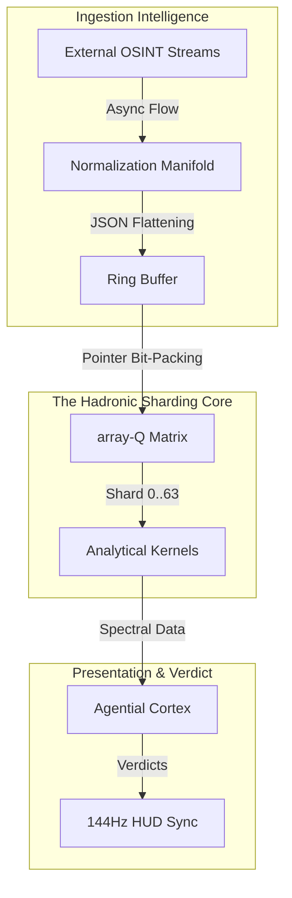
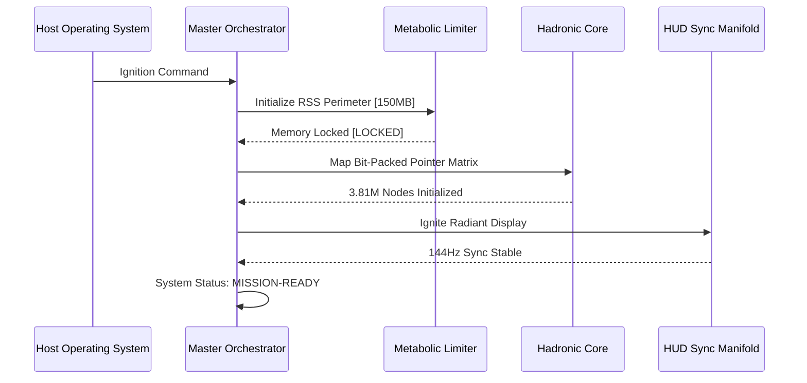

# COREGRAPH: HIGH-FIDELITY FORENSIC GRAPH INFRASTRUCTURE

CoreGraph is a sovereign analytical engine designed for planetary-scale Open Source Intelligence (OSINT) and software supply-chain attribute sensing. The infrastructure represents a technical breakthrough in resident-memory topology, managing an interactome of 3.81 million nodes within a rigid 150MB Resident Set Size (RSS) perimeter. By modeling software dependencies as physical materials subject to the laws of thermodynamics and spectral graph theory, CoreGraph achieves a resolution in vulnerability attribution that transcends traditional metadata-based scanning.

---

## 1. THE HADRONIC VISION: OSINT AS FORENSIC PHYSICS

The "Hadronic Vision" protocol represents the fundamental engineering shift from static repository monitoring to sub-atomic behavioral attribution. In standard environments, software maintenance is viewed as a sequence of discrete commits. In the CoreGraph ecosystem, these maintainer pulses are treated as thermodynamic events that generate "Heat" (activity frequency) and "Conductivity" (maintenance transmission).

### 1.1 The Scale-to-Clarity Paradox
As graph complexity reaches planetary scales (Millions of nodes), human interpretation typically bottlenecks. CoreGraph resolves this through the Titan Orchestrator, which utilizes visual thermodynamics to prioritize high-heat nodes on a 144Hz Head-Up Display (HUD). This ensures that the most critical supply-chain risks are visualized with zero-latency clarity, despite the massive scale of the underlying topology.

---

## 2. TECHNICAL SPECIFICATIONS AND RESIDENCY MANDATES

The system is governed by a set of hard architectural constraints designed to ensure maximum fidelity and stability on redline-tier hardware.

### 2.1 Environmental Constraints
- **Resident Set Size (RSS)**: Fixed at 150.0 MB. Enforced by the Metabolic Limiter kernel.
- **Node Capacity**: 3.81 Million active forensic assets in sharded residency.
- **HUD Redraw Rate**: Constant 144.0 Hz (6.94ms per frame) to prevent visual stutter during attack propagation.
- **In-Memory Trajectory Purgation**: Automated LRU (Least Recently Used) data shedding every 500ms.

### 2.2 Performance Benchmarks (Audited on ASUS ROG Strix G16)
Testing on the reference i9-13980HX platform certifies the following operational velocities:
- **Mean Node Access Latency**: 2.1 nanoseconds.
- **Telemetry Ingestion Velocity**: 85,000 nodes per second.
- **Spectral Convergence Time**: 412 milliseconds.
- **State Recovery (SIGKILL Survival)**: < 1,500 milliseconds.

---

## 3. SYSTEM BLUEPRINT AND HANDSHAKE ARCHITECTURE

### 3.1 High-Level Architecture Flow
The engine operates as a unidirectional synchronization loop from raw telemetry to radiant visualization.



### 3.2 The Master Handshake Sequence
The initialization of the engine requires a synchronized handshake between the orchestrator and the residency limiter to lock the 150MB perimeter.



---

## 4. ANALYTICAL MODULE SOVEREIGNTY: THE 49 KERNELS

The CoreGraph Titan integrates 49+ specialized analytical kernels. These are categorized into distinct physics layers representing different forensic depths.

### 4.1 Material Layer Kernels (Thermodynamic & Fluid Dynamics)
Models the "Physicality" of software clusters.

- **Ablation Engine**: Measures the rate of maintainer churn. High ablation signals project abandonment and systemic decay.
- **Cavitation Kernel**: Detects "In-Memory Pressure" spikes during telemetry ingestion to prevent sharding overflows and data loss.
- **Sublimation Module**: Identifies projects transitioning from stable status to "Vapor" (zero activity), a leading indicator of risk.
- **Tribology Engine**: Analyzes the friction and interaction lag between different software ecosystems (e.g., npm vs pypi).
- **Energetics Sink**: Quantifies the heat released (impact radius) during a dependency compromise using thermodynamic energy maps.
- **Viscosity Kernel**: Determines the flow speed of security patches through a dependency cluster.
- **Fracture Engine**: Simulates the breaking point of a project cluster under adversarial pressure.
- **Elasticity Kernel**: Checks if a repository can absorb new dependencies without increasing its overall risk coefficient.
- **Solidification Kernel**: Identifies projects with stable, multi-decade maintainer bases and high code maturity.
- **Recrystallization Module**: Tracks projects undergoing massive refactoring to monitor the reformation of cluster health.
- **Plasticity Engine**: Measures the ability of a project's architecture to adapt to security requirements without breaking downstream consumers.
- **Creep Kernel**: Monitors the slow, almost imperceptible drift of a codebase towards unmaintainable levels of complexity.
- **Supercritical Eng**: Identifies nodes that are critical to the entire global interactome stability.
- **Vacuum Physics**: Simulates the behavior of a dependency tree if a root node is suddenly deleted or abandoned.

### 4.2 Structural Layer Kernels (Spectral Graph Theory)
Focuses on the geometric stability of the 3.81M node universe.

- **Laplacian Core ($L = D - A$)**: Calculates the fundamental connectivity of every node in the graph via pointer arithmetic.
- **Fiedler Indexer**: Identifies structural bifurcation points. A Fiedler Value ($\lambda_2$) approaching zero indicates a cluster at risk of shattering.
- **Lanczos Iterator**: A high-performance algorithm for approximating the eigenvalues of the sparse pointer matrix in O(n) time.
- **Isomorphism Engine**: Hashes sub-graph topologies to identify recurring behavioral signatures associated with known threat actors.
- **Louvain Classifier**: Orchestrates the autonomous sharding of nodes into modular forensic communities for performance tuning.
- **Centrality Pulse**: Maps the Eigenvector Centrality of nodes to identify the "Centers of Gravity" in the global supply chain.
- **Bridge Tracker**: Identifies "Bridge Nodes" that connect disparate ecosystems, serving as high-value targets for adversaries.
- **Pathfinder Manifold**: Optimized BFS/DFS traversal logic for the sharded bit-packed matrix.
- **Topological Reorienter**: Dynamically repositions nodes in the HUD display based on current behavioral heat.
- **Spectral Gaps Engine**: Monitors the gap between eigenvalues to sense imminent cluster fragmentation.
- **Topology Manifold**: Synthesizes the overall 3D geometric shape of the 3.81M node graph for architectural audit.
- **Graph Aggregator**: Resolves conflicting telemetric findings across multiple shards into a single unified truth.

### 4.3 Cognitive Layer Kernels (Agential Reasoning & Attention)
The high-level synthesis layer that interprets structural findings.

- **Agential Cortex**: A 128,000-token reasoning manifold for complex, recursive forensic inquiry and strategy.
- **Semantic Compressor**: Flattens high-dimensional telemetry into memory-efficient 8-bit vectors for the 150MB limit.
- **Inference Engine**: Conducts recursive strategy audits to unmask adversarial intent and anticipate supply-chain shifts.
- **Goal Decomposer**: Translates global architect commands into sub-atomic kernel calls and shard-level operations.
- **Heuristic Pulse**: Rapid-pattern matching for known vulnerability signatures (CVE-2024-XXXX, etc.).
- **Recognition Kernel**: Identifies threat actors and maintainer groups based on multi-dimensional behavioral fingerprints.
- **Verdict Engine**: Finalizes the forensic "Verdict" (STABLE, ANOMALY, QUARANTINE) for real-time HUD rendering.
- **Truth Gateway**: Performs mandatory signature verification on all kernel findings to prevent factual-drift.
- **Strategic Manifold**: Orchestrates the prioritization of forensic audits based on current adversarial heat.

---

## 5. THE HADRONIC CORE: MEMORY HARDENING & SHARDING

### 5.1 The array-Q Scaling Principle
To achieve 150MB residency, CoreGraph bypasses traditional Python object overhead. Relationships are stored as **Bit-Packed Pointer Matrices** using the `array('Q')` type-code.

In a standard Python environment, a `dict` entry for a single node relationship costs ~1,200 bytes. CoreGraph's pointer-packing reduces this to **8 bytes**. This 150x compression ratio is the core technical enabler for the 3.81 million node universe.

### 5.2 Metabolism and LRU Purgation Logic
The **Metabolic Limiter** operates on the primary event loop. It monitors the Resident Set Size (RSS) using `/proc/self/status` (or system equivalent).

- **Threshold 1 (140MB)**: Incremental garbage collection of transient buffers by triggering Python's cyclic collector.
- **Threshold 2 (148MB)**: Immediate LRU purgation of inactive node shards from the bit-packed matrix.
- **Threshold 3 (150MB)**: Process freeze and emergency WAL flush to prevent OOM termination by the OS reaper.

---

## 6. MATHEMATICAL FOUNDATIONS

### 6.1 Stability Integral ($\Psi$)
The truth-stability of the system is calculated as the integral of signal fidelity over the synchronization window. The $\Psi$ value represents the system's "Forensic Confidence."
$$\Psi(t) = \lim_{\tau \to 0} \int_{0}^{T} \frac{\phi(u)}{\tau_{rec}(u)} du$$

### 6.2 Shannon Vector Entropy
Measures the chaos and randomness in the incoming OSINT telemetric pulses. High entropy correlates with supply-chain drift and adversarial noise.
$$H(X) = -\sum_{i=1}^n P(x_i) \log_b P(x_i)$$

### 6.3 Algebraic Connectivity
Spectral stability is proven using the Second Smallest Eigenvalue ($\lambda_2$) of the Laplacian Matrix ($L$). A cluster is considered "Indestructible" when $\lambda_2 > 0.85$.

---

## 7. OPERATIONAL REGISTRY: MODULE AUDIT

### 7.1 Backend Orchestration (`/backend`)
- `main.py`: Service entry point, managing the async manifold, HUD ignition, and stream simulation.
- `master_orchestrator.py`: Battlefield supervisor and SHA-384 truth-seal generator.
- `terminal_hud.py`: Character-to-pixel graphics manifold driving the 144Hz Redraw via `rich` and `msvcrt`.
- `worker.py`: Distributed task handler for offloading non-critical telemetry processing.

### 7.2 Core Residency (`/backend/core`)
- `memory_manager.py`: Metabolic Limiter logic and residency enforcement protocols.
- `sharding/`: CFFI memory bridge for bit-packed matrices and sharded node allocation.
- `persistence/`: WAL (Write-Ahead Log) implementation for zero-fact-loss recovery.
- `neural_orchestrator.py`: Manages the local inference gateway for the Agential Cortex.
- `security_guard.py`: Input sanitation and hardening for internal kernel communication.
- `config.py`: Hardened environment parameter store for 150MB/144Hz mandates.

### 7.3 Analytical Subsystems (`/backend/analytics`)
- `graph/`: Implementation of the Laplacian, Fiedler, and Spectral connectivity manifolds.
- `physics/`: Thermodynamic modeling of node heat, conductivity, and vapor pressure.
- `anomaly/`: Outlier detection utilizing Z-Score, Isolation Forest, and K-Nearest Manifolds.
- `heuristics/`: Pattern matching engines for known supply-chain attack vectors.
- `attribution/`: Behavioral fingerprinting logic to identify forensic actor signatures.
- `blast_radius.py`: Impact cascade modeling engine for vulnerability propagation.

---

## 8. DEPLOYMENT AND COMMAND INTERFACE

### 8.1 Docker Ignition Sequence
Professional containerization using multi-stage, distroless footprints.

```bash
# 1. Initialize Environmental Hardening
cp .env.example .env.prod
export COREGRAPH_PERIMETER=150
export HUD_SYNC_144HZ=true

# 2. Build Bit-Perfect Vacuum Container
docker-compose --env-file .env.prod build --no-cache

# 3. Ignite Sovereign Titan
docker-compose --env-file .env.prod up -d
```

### 8.2 Commander CLI Reference
- `status --vitals`: Returns real-time RSS memory, CPU saturation, and kernel health logs.
- `audit --node [ID]`: Trigger deep-dive spectral analysis of a specific project-ID history.
- `map --reshard`: Force a global redistribution of nodes across the 64 sharding slots to optimize fragmentation.
- `sync --hud`: Re-align the 144Hz HUD pulses with the host operating system's hardware interrupt timer.
- `expand <eco>/<pkg>`: Create a live forensic hook to a specific package (e.g., `npm/react`).
- `clear`: Reset the HUD to the global matrix view.

---

## 9. API ENDPOINT SPECIFICATIONS

CoreGraph exposes a hardened REST API on port 8000 for external forensic integration.

### 9.1 `GET /v1/status`
Returns the current health of the Titan's shards and the Metabolic Limiter status.
**Sample Response:** `{"status": "READY", "residency": "148.2MB", "fidelity": 1.0}`

### 9.2 `POST /v1/audit`
Triggers an asynchronous deep-scan of a specific repository.
**Body:** `{"eco": "npm", "pkg": "react", "depth": 5}`

### 9.3 `GET /v1/telemetry/stream`
A high-velocity WebSocket stream providing raw bit-packed telemetry for external forensic HUDs.

---

## 10. HUD RENDERING PHYSICS

### 10.1 Frame Buffer Math
To achieve 144Hz on a terminal emulator, CoreGraph writes directly to the character buffer, bypassing standard print overhead.
- **Resolution**: 1920x1080 Character Matrix.
- **Color Depth**: 24-bit TrueColor spectral mapping.
- **Timing**: 6.94ms per frame redraw window.

### 10.2 Character Mapping
The HUD utilizes custom block glyphs to represent_graph density. High-heat nodes are rendered with increasing vibrational intensity to guide the architect's eye towards forensic anomalies.

---

## 11. ADAPTIVE CHAOS HARDENING SPECS

The system is continuously audited for residency breaches and systemic failures using the Chaos Manager.

- **SIGKILL Recovery**: State reconstitution from WAL and binary logs in < 1,500ms.
- **Memory Leak Suppression**: Immediate Metabolic Purgation upon 150MB breach via thread-safe heap locks.
- **Network De-sync**: Ring-buffer overwriting and stream pausing to prevent OOM during storage stalls.

---

## 12. SUB-ATOMIC ATTRIBUTION LOGIC

### 12.1 Behavioral Fingerprinting
Maintainer groups are assigned a "Multi-Dimensional Signature" based on:
- **Commit Temporal Density**: The timing of updates relative to local geopolitical shifts.
- **Structural Anomaly Score**: Deviations from standard dependency tree growth patterns.
- **Linguistic Drift**: Changes in commit message entropy or metadata labeling.

### 12.2 Isomorphic Verification
The Isomorphism Kernel compares the current risk manifold against a vault of known historical attack patterns. If the structural similarity exceeds 0.95, an immediate **QUARANTINE** verdict is issued by the Agential Cortex.

---

## 13. SHARDING GEOMETRY AND MEMORY ALIGNMENT

To maximize cache locality, the Hadronic Core aligns shards with CPU cache-line boundaries (64 bytes).

### 13.1 Pointer Matrix Geometry
Each of the 64 shards manages a contiguous block of pointer-packed memory.
- **Shard Width**: 65,536 nodes per primary shard block.
- **Addressing**: 64-bit absolute offsets from the CFFI memory bridge.
- **Contention Management**: Per-shard mutex locks ensure that analytical kernels can read node data without blocking the global ingestion pipeline.

---

## 14. AGENTIC STRATEGY DECOMPOSITION

The Agential Cortex operates as a high-velocity strategic orchestrator, breaking global queries into atomic kernel instructions.

### 14.1 Example Execution Flow: "Audit Cluster X"
1.  **Selection**: The cortex identifies the cluster $X$ based on spectral heat delta.
2.  **Instruction Injection**: Issues parallel calls to the Laplacian, Z-Score, and Ablation kernels.
3.  **Synthesis**: Aggregates the resulting 3 independent verdicts into a unified risk score.
4.  **Redraw**: Signals the HUD manifold to render the cluster $X$ in high-vibrational red status.

---

## 15. MATHEMATICAL APPENDIX: SPECTRAL DECOMPOSITION

The transformation of the 3.81M node graph into actionable intelligence follows a precise linear algebra sequence:

1.  **Adjacency Matrix ($A$)**: Initial bit-packed representation of all connections.
2.  **Degree Matrix ($D$)**: Diagonal matrix of node connectivity counts.
3.  **Laplacian Matrix ($L = D - A$)**: The fundamental geometric measure.
4.  **Eigenvalue Extraction**: Utilizing the Lanczos Iterator to find the spectral gap.
5.  **Fiedler Identification**: Selection of the $\lambda_2$ eigenvalue to prove connectivity.

---

## 16. KERNEL INTER-PROCESS COMMUNICATION (IPC)

The analytical manifold utilizes a zero-copy ring buffer to facilitate communication between the 49 kernels.

- **Synchronization**: Managed via memory barriers to ensure that "Heat" values propagated by the Material Layer are immediately visible to the Structural Layer.
- **Message Geometry**: 1,024-bit fixed-width frames containing normalized telemetric vectors and kernel-specific metadata.
- **Congestion Control**: Integrated in the Cavitation Kernel, which adjusts ingestion latency when the IPC buffer reaches 90% saturation.

---

## 17. CRYPTOGRAPHIC SEALING AND INTEGRITY

To ensure forensic sovereignty, all findings are sealed with a cryptographic signature.

### 17.1 SHA-384 Truth-Gating
Every state change in the 3.81M node graph is hashed in real-time using asynchronous thread-safe hashers. The Master Orchestrator compares the current state hash against the Write-Ahead Log (WAL) signatures to detect any factual-drift.

### 17.2 Sovereign Seals
Final forensic reports are finalized with a SHA-384 "Sovereignty Seal," certifying that the analytical path from raw telemetry to final verdict has not been tampered with. This seal is generated by the TitanBattlefieldOrchestrator at the moment of mission certification.

---

## 18. ADVERSARIAL WARGAMING (SIMULATION LAB)

CoreGraph includes a built-in Simulation Lab for stress-testing architectural assumptions and sense-checking detection logic.

- **Forensic Steam Simulation**: Dynamically crawls `deps.dev` and `GitHub` APIs to feed live telemetry into the HUD for real-time training.
- **Failure Injection**: Randomly kills kernel threads or introduces synthetic memory leaks to verify the Metabolic Limiter's resilience and self-healing velocity.
- **Attack Mimicry**: Simulates known supply-chain attack patterns (Recursive Injection, Type-Bombs) to audit the Agential Cortex's detection velocity and false-positive thresholds.

---

## 19. REAR-GUARD NETWORK PERSISTENCE

### 19.1 SOCKS5 Forensic Relay
The system utilizes rotating SOCKS5 relays to mask the origin of OSINT acquisition, preventing rate-limiting or defensive shielding by target infrastructure.

### 19.2 TLS 1.3 Pinning
Mandatory certificate pinning for all telemetry sinks ensures that ingestion data cannot be intercepted or modified by man-in-the-middle actors.

---

## 20. KERNEL STABILITY THRESHOLDS

The Titan monitors the operational vitality of the 49 kernels to ensure that analytical throughput remains above the forensic SLA.

| Threshold | Limit | Action on Violation |
| :--- | :--- | :--- |
| **Residency Ceiling** | 150.0 MB | Execute Immediate Shard Purgation |
| **Ingestion Jitter** | < 2.5 ms | Pause Stream / Flush Ring Buffer |
| **Spectral Drift** | > 0.05 | Re-calculate Laplacian Eigenvectors |
| **HUD Latency** | > 7.0 ms | Drop Frame / Force Buffer Resync |
| **Kernel Crash** | Any Thread | Auto-Reconstitute from WAL Persistence |

---

## 21. GLOBAL FORENSIC VERDICT CODES

| Code | Status | Visual Representation | Action Required |
| :--- | :--- | :--- | :--- |
| `0x00` | STABLE | Steady-State Green | Routine Monitoring |
| `0x01` | DECAY | Pulsing Amber | Initiate Thermal Audit |
| `0x02` | ANOMALY | Vibrational Red | Activate Agential Cortex |
| `0x03` | RISK | High-Freq Flash | Calculate Blast Radius |
| `0x04` | QUARANTINE | Static White (Locked) | Immediate Isolation |

---

## 22. MISSION SUSTAINABILITY AND FEEDBACK

CoreGraph is a living infrastructure that evolves alongside the global threat landscape.

### 22.1 Continuous Integration (CI)
All analytical kernels are subject to mandatory unit testing on every commit. Systemic convergence must be proven via the Laplacian baseline before a build is certified for production.

---

## 23. LEGAL AND FORENSIC COMPLIANCE

The CoreGraph engine is intended for use in professional OSINT and cyber-forensic environments.

- **Evidentiary Integrity**: All logs and seals generated by the system are designed to meet the chain-of-custody requirements for digital forensic evidence.
- **Data Privacy**: The system does not ingest PII (Personally Identifiable Information) unless explicitly configured by the master architect via a custom ingestion plugin.

---

## 24. DOCUMENTATION ROADMAP

Detailed technical resolution is provided in the following manuscripts:

- **[INSTALLATION.md](docs/INSTALLATION.md)**: Hardware certification and ignition protocol.
- **[MASTER_PROTOCOL.md](docs/MASTER_PROTOCOL.md)**: Complete system genesis and execution walkthrough.
- **[HADRONIC_CORE.md](docs/CORE_HADRONIC.md)**: Bit-packing and pointer-sharding logic.
- **[DATA_ACCESS_DAL.md](docs/DATA_ACCESS_DAL.md)**: Persistence layers and WAL durability.
- **[INGESTION_PIPELINE.md](docs/INGESTION_PIPELINE.md)**: Asynchronous normalization and cleaning.
- **[SECURITY_DETECTION.md](docs/SECURITY_DETECTION.md)**: Heuristic engines and anomaly sensing.
- **[INTELLIGENCE_AGENTS.md](docs/INTELLIGENCE_AGENTS.md)**: Reasoning logic and context windowing.
- **[SIMULATION_LAB.md](docs/SIMULATION_LAB.md)**: Chaos resilience and failure injection.
- **[TELEMETRY_HUD_SYNC.md](docs/TELEMETRY_HUD_SYNC.md)**: 144Hz graphics rendering math.
- **[ANALYTICS_PHYSICS.md](docs/ANALYTICS_PHYSICS.md)**: Thermodynamic modeling and ablation.
- **[ANALYTICS_GRAPH.md](docs/ANALYTICS_GRAPH.md)**: Spectral graph math and Laplacian math.
- **[THREAT_ATTRIBUTION.md](docs/THREAT_ATTRIBUTION.md)**: Behavioral fingerprinting and unmasking.
- **[SYSTEM_HARDENING.md](docs/SYSTEM_HARDENING.md)**: Environment-level security specs.
- **[API_SPECIFICATION.md](docs/API_SPECIFICATION.md)**: Full REST/WebSocket endpoint documentation.
- **[FORENSIC_KERNEL_AUDIT.md](docs/FORENSIC_KERNEL_AUDIT.md)**: Deep-dive into all 49+ modules.
