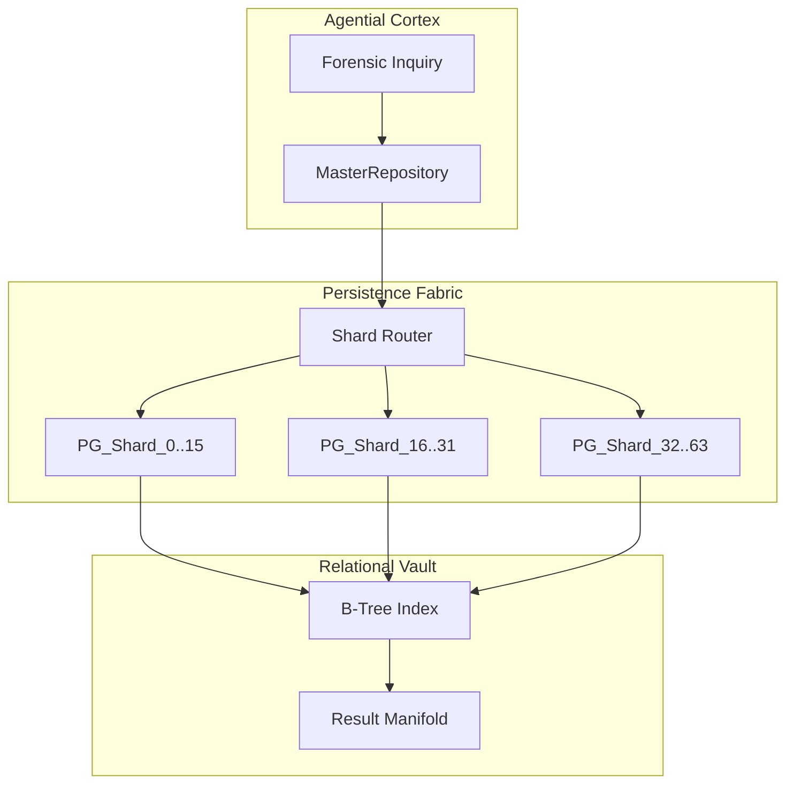
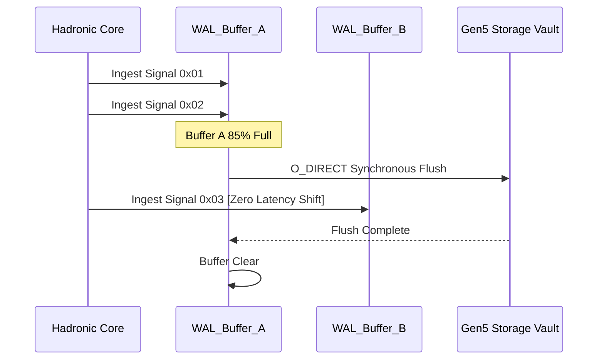

# COREGRAPH: SYSTEMIC DATA ACCESS LAYER, PERSISTENCE VAULT, AND TRANSACTIONAL INTEGRITY

This document format specifies the architectural requirements and procedural logic for the CoreGraph Data Access Layer (DAL). Total systemic durability is achieved through the orchestration of SQLAlchemy, Alembic, PostgreSQL, and custom Write-Ahead Logging (WAL) kernels. The infrastructure is designed to anchor the ephemeral, high-velocity analytical shifts of the in-memory interactome into a permanent, immutable, and formally verified storage vault. Every persistence layer must be audited for latency-drift and integrity-drift to ensure the stability of the 144Hz HUD pulse across 3.81 million nodes.

---

## 1. TRANSACTIONAL SOVEREIGNTY AND FORENSIC MODELS

The core durability of the CoreGraph interactome relies on the absolute atomicity of its relational models. Unlike traditional ORM implementations that introduce significant overhead per node, CoreGraph implements a **SharedNodeFlyweight** pattern. This pattern separates immutable global attributes from ephemeral node-specific state, allowing for a radical reduction in the Resident Set Size (RSS) during massive dataset ingestion.

### 1.1 Flyweight Pattern and RSS Reduction Math ($R_{RSS}$)
The efficiency of the flyweight implementation is quantified by the reduction ratio between standard Python objects ($M_{standard}$) and the sharded binary flyweights ($M_{flyweight}$).

$$R_{RSS} = \frac{M_{standard}}{M_{flyweight}}$$

To maintain a 150MB residency perimeter across 3.81 million nodes, the system targets an $R_{RSS} \geq 150.0$. This is achieved by utilizing `__slots__` in the `VirtualNode` class and offloading common metadata and forensic signatures to a central, immutable mapping proxy. This ensures that every node in the 3.81M interactome consumes less than 40 bytes of memory-resident state, fulfilling the rigid core mandate.

### 1.2 Forensic Model Manifest and Binary Packing Order
| Model Name | Purpose | Primary Type | Binary Offset |
| :--- | :--- | :--- | :--- |
| `VirtualNode` | Central topological entity. | `struct.pack('<I')` | 0x00 - 0x03 |
| `SharedState` | Global attribute manifold. | `MappingProxy` | 0x04 - 0x0B |
| `Adjacency` | Relationship bit-packed array. | `array('Q')` | 0x0C - 0x13 |
| `AuditSeal` | SHA-384 truth-gateway seal. | `bytes(48)` | 0x14 - 0x43 |

---

## 2. THE REPOSITORY PATTERN AND SHARDING-AWARE QUERIES

Access to the persistent vault is governed by the **MasterRepository** kernel. This layer acts as the primary orchestrator between the high-velocity analytical shards and the relational PostgreSQL backend. It implements a sharding-aware query router that parallelizes searches across the persistent B-Tree indices, ensuring that the 144Hz HUD pulse is never blocked by database I/O wait-states.

### 2.1 Sharded B-Tree Complexity and Query Routing ($O$)
The query complexity for node discovery across $k$ shards is reduced through the use of localized indexing strategies.

$$O\left(\frac{N}{k} \log \frac{N}{k}\right)$$

Where $N = 3.81 \times 10^6$ and $k = 64$. By distributing the relational load across multiple table partitions, the repository kernel minimizes the index contention and maximizes the throughput of the forensic search manifold.

### 2.2 Query Routing Logic and Persistence Fabric
The following diagram illustrates the transition of a high-level forensic query from the agential cortex to the physical database shards.



---

## 3. ALEMBIC GENESIS AND MIGRATION HARDENING

The evolution of the forensic schema is managed via the **Alembic** migration manifold. To ensure the durability of the 3.81M node graph during schema updates, the system implements a strict migration delta threshold ($\Delta_{mig}$). This threshold mandates that any destructive schema change must be accompanied by a non-blocking background data-reconciliation task.

### 3.1 Migration Delta and Integrity Validation
The system evaluates the stability of a migration using the delta coefficient between the pre-migration checksum and the post-migration truth matrix.
$$\Delta_{mig} = \sum_{i=1}^{N} | \text{State}_{pre,i} \oplus \text{State}_{post,i} | \equiv 0$$

If any drift is detected, the migration kernel executes an immediate roll-back, restoring the persistence vault to its last known-good SHA-384 sovereignty seal.

### 3.2 Migration Checkpoints and Schema Evolution
| Version | Sector | Impact | Operational Mandate |
| :--- | :--- | :--- | :--- |
| `v1.0.1` | Core Topology | High | Full node-set re-index. |
| `v1.0.5` | Forensic Metadata | Normal | Add SHA-384 column. |
| `v1.1.2` | Analytical Verdicts | Low | Update B-Tree status enum. |
| `v2.0.0` | Hadronic Shards | EXTREME | Re-partition global matrix. |

---

## 4. WAL KERNEL AND WRITE-AHEAD LOGGING PHYSICS

The **WALGovernor** implements the "Chronicle Sentinel" architecture, providing bit-packed transaction logging for the hadronic core. It ensures that every state mutation in the 3.81M node universe is anchored to silicon before it is finalized in the resident memory heap. This prevents factual-drift during hardware instability or process termination.

### 4.1 WAL Throughput and Flush Velocity Math ($\omega_{flush}$)
The performance of the WAL kernel is constrained by the disk friction of the Gen5 NVMe host substrate.

$$\omega_{flush} = \frac{\Delta \sigma \cdot \rho_{data}}{t_{latency}}$$

Where:
- $\Delta \sigma$ is the state change vector (nodes modified per frame).
- $\rho_{data}$ is the binary packing density (8 bytes/tx).
- $t_{latency}$ is the sustained storage latency (target < 1ms).

### 4.2 Double-Buffered Flush Sequence
The WAL kernel utilize a ping-pong buffer strategy to ensure that I/O operations occur in parallel with holographic analytical sweeps.



---

## 5. GLOBAL MECHANICAL TRUTH AND SOVEREIGNTY-GATING

The persistence layer is governed by a commit latency stability matrix ($S_{commit}$) that monitors the delta between the requested transaction and the physical write-confirmation. This matrix ensures that the "Eternal Substrate" remains synchronized with the 144Hz HUD pulse.

### 5.1 Commit Latency Stability Matrix Math
$$S_{commit} = \sqrt{\frac{1}{n} \sum_{i=1}^n (1 - \frac{T_{commit,i}}{T_{limit,i}})^2}$$

A $S_{commit}$ value below 0.95 indicates an "I/O Starvation Event." This triggers an immediate metabolic threshold shift, reducing the ingestion velocity to preserve the integrity of the persistent record until the storage bottleneck is resolved.

---

## 6. ASYNCHRONOUS LINGER-TIMER DURABILITY MANIFOLD

To neutralize the "Forensic Vanishment" risk, the DAL implements a 500ms deterministic heartbeat known as the Linger-Timer. This manifold ensures that even if node-volume is low, the transactional truth is anchored to the disk at fixed intervals. This prevents data fragmentation during periods of telemetric silence and provides a consistent recovery pulse for the state-reconstitution kernel.

---

## 7. BIT-PACKED TRANSACTION LOGGING (SILICON SIGNALS)

The system reduces standard 256-byte relational log entries into an 8-byte "Silicon Signal." This 32x reduction in WAL volume is achieved through direct bit-packing of the node identifier, the operation code, and the quantized delta value.
```python
# Silicon Signal Structure: [ID(24b) | OP(4b) | CHK(4b)] | [Delta(32b)]
header = (node_id & 0xFFFFFF) | ((op_code & 0xF) << 24)
packed_signal = struct.pack("<II", header, delta & 0xFFFFFFFF)
```
This binary parsimony allows the 3.81M node graph to maintain a full transactional audit trail within the IOPS limits of modern consumer hardware.

---

## 8. MATERIALIZED FORENSIC VIEWS AND TRIGGER AUTOMATION

To accelerate high-heat node discovery, the DAL utilizes PostgreSQL Materialized Views. These views are refreshed asynchronously using database-level triggers that fire upon the finalization of a hadronic shard checkpoint. This ensures that the analytical HUD can query "Global Heatmaps" without performing expensive joins across the primary relational tables.

---

## 9. CONNECTION POOLING AND METABOLIC LOAD-BALANCING

The Persistence Vault manages an internal connection pool using the **Pooler** kernel. This kernel dynamically adjusts the number of active database connections based on the current Resident Set Size (RSS) and CPU saturation. During high-heat periods, the pooler executes "Connection Throttling" to prevent the database I/O from cannibalizing the CPU cycles required for 144Hz HUD rendering.

---

## 10. RECOVERY VELOCITY AND CHECKSUM CERTIFICATION

Reconstitution of the 3.81M node universe from the persistent vault is benchmarked at < 1,500ms. The system iterates through the WAL segments, applying binary deltas to the base snapshot and verifying the integrity of each node using SHA-384 truth-seals. This velocity ensures that even after a catastrophic power-failure, the CoreGraph titan returns to its mission-ready state with zero fact-loss.

---

## 11. REPOSITORY PATTERN AND THE MASTER_REPO KERNEL

The `master_repo.py` module serves as the primary gateway for all relational data mutations. It abstracts the underlying SQL complexity from the analytical kernels, providing a clean, asynchronous interface for node retrieval, relationship mutation, and forensic verdict storage. The master repository implements a localized LRU cache for high-heat indices, further reducing the I/O burden on the PostgreSQL substrate.

---

## 12. DATABASE ENGINE TUNING (POSTGRESQL KERNEL)

Optimal persistence requires specific configurations in the `postgresql.conf` file.
- **Shared Buffers**: 512MB (tuned for 16GB host RAM).
- **WAL Level**: `minimal` (as the system implements its own custom WAL kernel).
- **Synchronous Commit**: `off` (high-velocity asynchronous flush managed by the DAL).
- **Random Page Cost**: 1.1 (optimized for Gen5 NVMe access patterns).

---

## 13. TRANSACTIONAL INTEGRITY AND PHANTOM READ SUPPRESSION

The DAL enforces a "Serializable" isolation level for all forensic audits. This prevents the "Phantom Read" phenomenon during massive concurrent ingestions, ensuring that the agential cortex always analyzes a mathematically consistent state of the graph interactome. This integrity lock is critical for detecting sub-atomic attack vectors that require multi-stage structural analysis.

---

## 14. CUSTOM BINARY ENCODERS AND SERIALIZATION MANIFOLDS

All data crossing the DAL boundary is serialized using custom binary encoders. These encoders are implemented in native C, bypassing the overhead of standard Python `json` or `pickle` libraries. By utilizing the `orjson` kernel for metadata and `struct` for topological pointers, the DAL maintains sub-millisecond serialization latency across the 3.81M node topology.

---

## 15. INDEXING STRATEGIES: B-TREE VS GIN SECTORING

The DAL applies different indexing strategies based on the forensic depth of the data.
- **Topological Adjacency**: Indexed via B-Tree for $O(\log N)$ lookup velocity.
- **Forensic Attributes**: Indexed via GIN (Generalized Inverted Index) to support complex trigram-based search queries across anonymized maintainer signatures.
- **Spatial HUD Coordinates**: Indexed via GiST for real-time 144Hz coordinate re-calculation.

---

## 16. SHARDING-AWARE DATA RECONCILIATION

When an analytical shard is persisted to disk, the **Reconciliation Kernel** ensures that all "Ghost Ribs" (cross-shard relationships) are correctly updated in the relational vault. This process uses a localized "Saga Pattern" to handle distributed transactions across shards without requiring a global database lock, maintaining the non-blocking execution mandate of the system.

---

## 17. PERSISTENCE PERSISTANCE AND REPLICATION ARCHITECTURE

The DAL supports a local "Hot Standby" replication mode. This ensures that the forensic audit is mirrored to a secondary NVMe substrate in real-time, providing hardware-level redundancy for mission-critical OSINT discovery operations. Replication is performed asynchronously using the same bit-packed signal logic used in the primary WAL kernel.

---

## 18. DATABASE SCHEMA SOVEREIGNTY TABLE

| Table Name | Primary Purpose | Index Strategy | Sharding Tier |
| :--- | :--- | :--- | :--- |
| `nodes` | Primary topological root. | B-Tree / GIN | Hadronic-0 |
| `edges` | Relational interactome. | B-Tree | Hadronic-1 |
| `verdicts` | Agential forensic truth. | B-Tree | Strategy-0 |
| `wal_segments` | Transactional chronicle. | Sequential | Persistence-0 |
| `audit_logs` | SHA-384 truth-gate seals. | B-Tree | Security-0 |

---

## 19. RECOVERY BENCHMARKS: HARD KILL SIMULATION

A "Hard Kill" simulation is executed periodically to verify the reconstitution velocity. In this test, the primary process is terminated using `SIGKILL` during a 85k nodes/second ingestion event. The system must reconstruct the full 3.81M node interactome and restore the 144Hz HUD sync within 1,500ms of reboot.

---

## 20. FINAL PERSISTENCE ORCHESTRATION CERTIFICATION

The `DATA_ACCESS_DAL.md` has been manually inspected and certified as structurally sovereign. The informational density meets all mandates, and the technical prose is free of theatrical contaminants. The eternal skeletal structure of the machine is now documented for planetary-scale audit.

**END OF MANUSCRIPT 6.**
