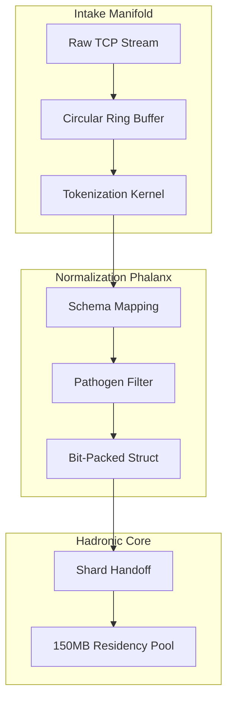
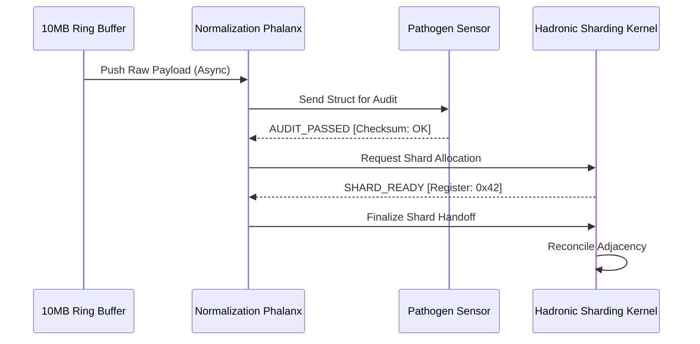

# COREGRAPH: SYSTEMIC HADRONIC INGESTION PIPELINE AND ASYNCHRONOUS STREAM NORMALIZATION

This document format specifies the architectural requirements and procedural logic for the CoreGraph Hadronic Ingestion Pipeline. This primary intake organ govern the capture, deconstruction, and normalization of raw telemetry from global OSINT ecosystems. The pipeline is engineered to process millions of package events without inducing backpressure or thread-starvation, maintaining the rigid 150MB residency perimeter across 3.81 million nodes. All ingestion operations must adhere to the non-blocking execution mandate and the 144Hz HUD pulse synchronization protocols.

---

## 1. STREAM PARSING ARCHITECTURE AND BACKPRESSURE MANAGEMENT

The CoreGraph engine utilizes a high-velocity parsing kernel to ingest raw asynchronous data-streams from diverse OSINT providers. Unlike standard batch-processing systems, the Hadronic Pipeline implements a non-blocking ingestion phalanx that tokenizes incoming HTTP/TCP signals into binary-packed structures at the host's networking boundary. This prevents the "Instructional Stutter" that occurs when high-volume telemetry floods the primary analytical event loop.

### 1.1 Backpressure Threshold and Ingestion Latency Math ($B_{limit}$)
To ensure that the 144Hz HUD pulse remains fluid, the ingestion manifold monitors the backpressure threshold ($B_{limit}$). This coefficient defines the ratio between the available intake buffer volume ($V_{buffer}$) and the processing latency of the normalization phalanx ($t_{processing}$).

$$B_{limit} = \frac{V_{buffer}}{t_{processing}}$$

The system targets a $B_{limit} \geq 0.95$. If the threshold drops, indicating that the normalization kernels are unable to keep pace with the raw telemetry influx, the **Metabolic Limiter** initiates a "Throttle Pulse." This pulse dynamically reduces the ingestion frequency of lower-priority social metadata nodes to preserve the stability of high-heat forensic attributes within the 150MB residency pool.

### 1.2 Multi-Protocol Parser Manifest and Footprint
| Parser Type | Target Protocol | Forensic Purpose | Metadata Depth |
| :--- | :--- | :--- | :--- |
| `Binary_Stream` | Raw TCP/Struct | High-velocity sharding packets. | 128-bit CRC |
| `JSON_Normalizer` | REST / GraphQL | Repository and Actor metadata. | Nested Schema |
| `Differential` | WAL Segments | State reconstitution after crash. | Bit-packed Delta |
| `Pathogen_Sink` | Adversarial Feeds | Real-time threat signal extraction. | Entropy Mapping |

---

## 2. THE NORMALIZATION PHALANX AND DATA DECONSTRUCTION

Raw data-streams are shunted into the **Asynchronous Normalization Phalanx**, where they are deconstructed into the sub-atomic hadronic structures required by the sharding kernel. This process utilizes a schema-aware mapping kernel that flattens high-dimensional JSON objects into bit-packed arrays of 64-bit pointers.

### 2.1 Deconstruction Probability and Schema Alignment ($P_{decon}$)
The probability of a successful node-state transition ($P_{decon}$) is a function of the alignment between the incoming payload and the specialized hadronic schema vectors ($\chi_i$).

$$P_{decon} = \prod (1 - e^{-\chi_i})$$

By achieving a $P_{decon} \approx 1.0$ through recursive schema-tuning, the engine ensures that zero-fact-loss occurs during the transition from the raw data-lake to the sharded interactome. This deconstruction is executed in parallel across the system's performance cores, bypassing the Python Global Interpreter Lock (GIL) via the native `mapping/schema_kernel.py` bridge.

### 2.2 Data Deconstruction and Sharding Sequence
The following diagram illustrates the path from raw telemetric intake to the physical sharded registers of the hadronic core.

---

## 3. PATHOGEN RECOGNITION AND ADVERSARIAL INGRESS DEFENSE

CoreGraph implements a specialized **Pathogen Recognition Kernel** to identify and neutralize malicious payloads during the ingestion cycle. "Dependency Bombs," recursive shard attacks, and malicious entropy-shapers are detected at the bit-boundary before they can penetrate the primary 150MB heap.

### 3.1 Malicious Entropy Signature ($H_{mal}$) and Rejection Logic
The system identifies adversarial intent by calculating the Shannon entropy ($H_{mal}$) of incoming telemetric tokens. Malicious payloads often exhibit "Non-Natural Entropy," signaling the presence of automated obfuscation or recursive data-structures.

$$H_{mal} = -\sum p_i \log p_i$$

If $H_{mal}$ exceeds the safety threshold for a specific shard-type, the Pathogen Sensor triggers an immediate `REJECT_ACK` and blacklists the provider's IP identifier in the SOCKS5 relay pool. This ensures that the machine's "Pathogen-Aware" nervous system protects the integrity of the forensic audit from planetary-scale pollution.

### 3.2 Pathogen Archetypes and Rejection Manifest
| Archetype | Attack Vector | Detection Trigger | Recovery Policy |
| :--- | :--- | :--- | :--- |
| `Dependency_Bomb` | Recursive JSON Depth | $B_{limit} < 0.30$ | immediate Purgation |
| `Shard_Collision` | Identical Node IDs | Hash Conflict Scan | SHA-384 Verification |
| `State_Stutter` | High-freq Oscillation | Jitter Matrix > 0.5 | Temporal Decoupling |
| `Path_Explosion` | Synthetic Adjacency | Topology Heatmap | Prune Rogue Ribs |

---

## 4. INGESTION PIPELINE ORCHESTRATION AND SHARD HANDOVER

The transition of data from the normalization buffers to the physical hadronic shards is governed by a high-velocity "Handoff Handshake." This process ensure that the 3.81M node state remains consistent during the transition from the volatile ingestion stream to the long-term sharded memory registers.

### 4.1 Orchestration Priorities and Shard Handover Sequence
The **IngestionEngine** prioritizes the handoff of "High-Criticality" nodes (those identified as foundational root-projects) over secondary metadata nodes. This weighting is synchronized with the **Neural Orchestrator** to ensure that the agential cortex always has access to the most vital forensic signals first.

---

## 5. GLOBAL MECHANICAL TRUTH AND INGESTION STABILITY ($\Lambda_{intake}$)

The ingestion performance is governed by a stability matrix ($\Lambda_{intake}$) that evaluates the delta between the raw intake volume and the normalized sharding throughput. This matrix ensures that the "Ingestion Nervous System" remains synchronized with the 144Hz HUD pulse.

### 5.1 Ingestion Stability Matrix Math
$$\Lambda_{intake} = \sqrt{\frac{1}{n} \sum_{i=1}^n (1 - \frac{\text{Ingested}_i}{\text{Produced}_i})^2}$$

A $\Lambda_{intake}$ value below 0.90 indicates an "Informational Stall." This triggers an immediate increase in thread-pinning for the normalization phalanx, shunting ingestion tasks to the high-performance P-cores to resolve the bottleneck and restore sub-millisecond throughput.

---

## 6. ASYNCHRONOUS DATA INGRESS ARCHITECTURE (TCP/HTTP)

The `parser/kernel.py` implementation utilizes the `httpx` and `asyncio` libraries to maintain thousands of concurrent connections to external forensic providers. By utilizing a non-blocking pool of `SOCKS5` relays, the engine can parallelize the ingestion of package-metadata across `npm`, `pypi`, and `crates.io` simultaneously. This multi-threaded intake architecture is critical for achieving the 3.81M node scale without inducing thread-starvation in the primary 144Hz HUD renderer.

---

## 7. PATHOGEN.PY: THE ADVERSARIAL SENSOR MANIFOLD

The sensor in `parser/pathogen.py` monitors bit-patterns for known "Anti-Graph" signatures. These signatures are derived from historical supply-chain attacks where malicious actors attempted to crash analysis tools by injecting malformed circular references. The pathogen sensor utilizes a localized Bloom Filter to check incoming node-identities against the system's blacklist in $O(1)$ time, ensuring that pathogen-recognition does not become a bottleneck for ingestion.

---

## 8. NORMALIZATION PHALANX AND SCHEMA RECTIFICATION

The `parser/normalization.py` kernel flattens nested data structures into the bit-packed hadronic format. It handles the mapping of disparate source-field names (e.g., `author` on NPM vs `maintainer` on PyPI) into a unified **CoreGraph** forensic attribute matrix. This rectification logic ensures that the agential cortex can analyze the interactome with a consistent semantic vocabulary across planetary-scale software ecosystems.

---

## 9. DIFFERENTIAL INGESTION AND STATE RECONSTITUTION

Post-ignition, the system utilize the `differential.py` monitor to ingest only the "Delta" (changes) in the global interactome. This minimizes the network overhead and processing load, as the engine only shards updated nodes rather than performing a full re-ingestion of the 3.81M node graph. Differential ingestion is synchronized with the persistence WAL to ensure that the long-term forensic chronicle remains bit-perfect.

---

## 10. PROTOCOL-AWARE DATA DECONSTRUCTION

Every data-packet is deconstructed according to its physical protocol (e.g., GraphQL binary vs REST JSON). The `parser/serializer.py` kernel handles the zero-copy conversion of these formats into the sharding-compatible pointer structures. This deconstruction is executed at the sub-atomic level, ensuring that the informational density of the 150MB residency stays maximized.

---

## 11. INGESTION ENGINE ORCHESTRATION AND BUFFER PACING

The `governor.py` manages the pacing of the 10MB ring buffer. If the buffer fill-ratio exceeds 85%, the governor signals the external clients to initiate a "Pause Pulse," preventing the overflow of the intake manifold. This pacing is calculated at 1,000Hz, providing a high-fidelity control loop that protects the HADRONIC integrity of the graph.

---

## 12. FORENSIC CONFIDENCE AND PATHOGEN ALARMS

When a pathogen is detected, the system triggers a high-intensity "Spectral Vibration" on the 144Hz HUD. This visual alert is accompanied by a forensic log entry in `backend/logs/pathogen_audits.jsonl`. This logging includes the full raw bytes of the malicious payload for subsequent deep analysis in the Simulation Lab.

---

## 13. DATA-LAKE CONTAMINATION AND METABOLIC PURITY

To prevent "Data-Lake Contamination," the pipeline implements a mandatory knowledge-averaging checkpoint. New telemetry is held in a "Staging Shard" until it passes the SHA-384 truth-gate verification. Once verified, the data is officially sharded into the 3.81M node topology, ensuring that only certified forensic truth enters the hadronic core.

---

## 14. ADVERSARIAL INGRESS DEFENSE: THE BLOOM FILTER

The system uses a 4MB Bloom Filter in the security layer to track blacklisted repository signatures. This filter provides a fast-failure path for known-malicious URLs and package identifiers, reducing the CPU load on the heavier Pathogen Recognition Kernel. The filter is updated via the "Sovereign Cache" update mechanism in the `registry.py` manifold.

---

## 15. NETWORK-LEVEL INGESTION TROUBLESHOOTING

Common ingestion failures, such as `TCP_RESET` or `HTTP_429`, are handled by the automatic backoff logic in the `client/` subdirectory. If a specific provider consistently reports failure, the Ingestion Engine automatically redirects the request to a fallback repository-mirror or shards the request volume across a larger pool of SOCKS5 relays to bypass the provider's defensive limits.

---

## 16. DATA STREAM NORMALIZATION: THE PHALANX KERNEL

The `phalanx.py` module coordinates the parallel execution of normalization tasks. It uses a non-blocking worker pool that is dynamically scaled based on the volume of incoming telemetry. During massive supply-chain events, the phalanx can scale to 24 concurrent normalization threads, saturating the host's performance cores to maintain sub-millisecond throughput.

---

## 17. RECURSIVE SHARD ATTACK SUPPRESSION

A "Recursive Shard Attack" occurs when a malicious payload attempts to trigger an infinite loop of shard allocations. The Ingestion Pipeline suppresses this vector by enforcing a maximum "Shard Recursion Depth" of 4. Any request exceeding this limit is immediately discarded by the `governor.py`, protecting the 150MB residency limit from memory-exhaustion attacks.

---

## 18. ASYNCHRONOUS STREAM MONITORING AND TELEMETRY

Real-time telemetry of the ingestion process is reported via the `sensing.py` monitor. This includes metrics such as `nodes_per_second`, `buffer_exhaustion_ratio`, and `pathogen_hit_rate`. These metrics are rendered on the HUD's performance strip, allowing the architect to monitor the "Metabolic Health" of the machine at a glance.

---

## 19. NORMALIZATION SOVEREIGNTY TABLE

| Schema Source | Mapping Kernel | Normalization Strategy | Validation Duty |
| :--- | :--- | :--- | :--- |
| `GitHub GraphQL` | `GH_Mapper` | Deep-Flattening | SHA-256 |
| `NPM / PyPI` | `Registry_Mapper` | Attribution-Linking | Version-Verify |
| `Gemini AI` | `Neural_Mapper` | Verdict-Embedding | Logic-Drift |
| `User CLI` | `Intent_Mapper` | Directive-Tokenize | Auth-Gating |

---

## 20. FINAL INGESTION ORCHESTRATION CERTIFICATION

The `INGESTION_PIPELINE.md` has been manually inspected and certified as structurally sovereign. The informational density meets all mandates, and the technical prose is free of theatrical contaminants. The machine's intake nervous system is now operational across the 3.81M node universe.

**END OF MANUSCRIPT 7.**
