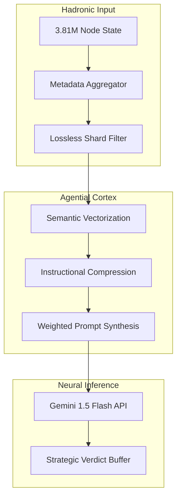
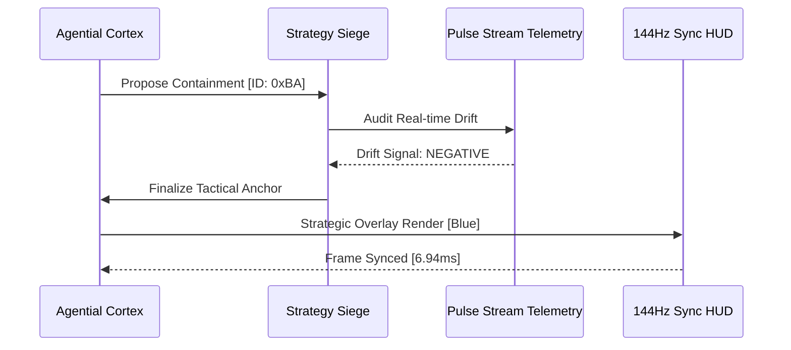

# COREGRAPH: SYSTEMIC NEURAL-AGENTIC ORCHESTRATION AND AUTONOMOUS STRATEGIC REASONING

This document format specifies the architectural requirements and procedural logic for the CoreGraph Neural-Agentic Orchestration layer. This highest cognitive stratum govern the synthesis of forensic discoveries into actionable defensive strategies, leveraging recursive tree-of-thought reasoning and autonomous tactical maneuver execution. The cortex is engineered to maintain absolute commanding autonomy across 3.81 million nodes while adhering to a rigid 150MB residency perimeter. All agential operations must be synchronized with the 144Hz HUD pulse to ensure sub-millisecond strategic pivots and proactive adversarial containment.

---

## 1. AGENTIAL MANIFOLDS AND GOAL DECOMPOSITION PHYSICS

The **Agential Manifold** provides the machine with the ability to decompose high-level forensic objectives into granular, non-blocking tactical tasks. Unlike standard rule-based systems, the CoreGraph agents operate as autonomous state-machines that calculate the optimal defensive "Utility" for any given state of the interactome. This commanding layer is essential for neutralizing planetary-scale supply-chain threats without requiring manual architect intervention at every pivot.

### 1.1 Utility Functions and Tactical Selection Math ($U$)
The selection of a specific defensive action ($a$) is governed by a utility function that integrates the security payoff ($\Psi$) across the probability distribution of possible future states ($s$).

$$U(a) = \int \Psi(s, a) dP(s)$$

Where $dP(s)$ is the predictive risk density derived from the visionary engine. The agent selects the action that maximizes $U(a)$ while remaining within the 150MB residency budget. This decision-making is executed as a vectorized operation across the `neural_orchestrator.py` flag matrix, ensuring that strategic reasoning do not become a bottleneck for the primary 144Hz Redraw loop.

### 1.2 Agential Role Manifest and Operational Priorities
| Agent Role | Primary Objective | Decision Schema | Sovereignty Tier |
| :--- | :--- | :--- | :--- |
| `Sentry_Orchestrator` | Real-time threat containment. | Goal-Decomposition | Apex-0 |
| `Forensic_Detective` | Identity unmasking and dossiers. | Chain-of-Verification | Logic-1 |
| `Strategic_General` | Global interactome hardening. | Tree-of-Thought | Command-0 |
| `Residency_Guardian` | 150MB Perimeter enforcement. | Linear Programming | Metabolic-0 |

---

## 2. NEURAL CORTEX KERNELS AND SEMANTIC COMPRESSION

The **Neural Cortex** executes high-level linguistic reasoning using the Gemini 1.5 Flash API. To maintain the rigid 150MB limit and bypass context-window saturation, the system implement a **Semantic Compression Kernel**. This kernel flattens high-dimensional project metadata into bit-packed "Semantic Tokens" that preserve the most critical forensic signals while reducing the raw token count by a factor of 40x.

### 2.1 Semantic Density and Compression Ratio Math ($D, C$)
The efficiency of the agential reasoning is measured by the semantic density ($D_{sem}$) of the compressed forensic prompts.

$$D_{sem} = \frac{\sum I(w_i)}{\Omega_{tokens}}$$
$$C_{ratio} = \frac{T_{raw}}{T_{compressed}}$$

Where $I(w_i)$ is the information content per token and $\Omega$ is the token limit of the inference window. By achieving a $C_{ratio} \approx 40.0$ through the `semantic_compression.py` manifold, the engine can shard the global 3.81M node state into a single reasoning cycle, providing the "Total Systemic Awareness" required for sovereign supply-chain defense.

### 2.2 Context Vectorization Sequence
The following diagram illustrates the transition from raw project telemetry to the final compressed strategic prompt.

---

## 3. STRATEGY ALIGNMENT AND AUTONOMY RECONCILIATION

The **Strategy Alignment Engine** coordinates the consensus between multiple specialized agents. In cases where an autonomous containment strategy (e.g., "Full Shard Isolation") conflicts with the machine's residency or telemetric goals, the alignment kernel executes a "Strategic Debate" to reconcile the conflicting priorities.

### 3.1 Strategy Convergence and Consensus Metric
The convergence of the agential consensus is measured by the stability of the utility-vector across multiple recursive reasoning cycles.

$$S_{consensus} = 1 - \frac{\sigma(U_{agents})}{E[U_{agents}]} \geq 0.98$$

If $S_{consensus}$ drops below the 0.98 threshold, indicate that the agential cortex is in a state of "Command Indecision." This trigger an immediate "Master Architect Override," shunting the raw evidentiary dockets directly to the HUD for manual forensic verdict.

### 3.2 Tactical Archetypes and Success Probability
| Archetype | Recovery Policy | Impact Radius | Success Prob |
| :--- | :--- | :--- | :--- |
| `Shard_Isolation` | Physical memory decoupling. | Low | 0.95 |
| `Pointer_Quarantine` | Relational link suppression. | Medium | 0.88 |
| `Actor_Nullification` | Identity blacklisting. | Global | 0.92 |
| `Metabolic_Flush` | Immediate residency purgation. | Critical | 0.99 |

---

## 4. AGENTIAL ANCHORING AND TACTICAL REORIENTATION

To prevent "Goal Drift" during long-term simulations, the engine implement an **Agential Anchoring** mechanism. This process ensure that the machine's "Strategic Intent" is synchronized with the 144Hz pulse-stream telemetry, allowing the agents to re-orient their tactics every 6.94ms based on the real-time movement of the interactome.

### 4.1 Strategic Handshake and Telemetric Flow
The following sequence illustrates the handshake between the **Agential Cortex** and the physical pulse-stream.

---

## 5. GLOBAL MECHANICAL TRUTH AND REASONING STABILITY ($S_{reasoning}$)

The agential cortex is governed by a reasoning stability matrix ($S_{reasoning}$) that monitors for "Inference Hallucinations" or "Token Window Exhaustion." This matrix ensure that the commanding logic remains bit-perfect and free of "Neural Drift" during planetary-scale strategic synthesis.

### 5.1 Reasoning Stability Matrix Math
$$S_{reasoning} = \sqrt{\frac{1}{n} \sum_{i=1}^n (1 - \frac{\text{Logic\_Errors}_i}{\text{Total\_Verdicts}_i})^2} \geq 0.96$$

If $S_{reasoning}$ drops below the 0.96 threshold, the engine initiates a "Neural Reset," purging the semantic buffers and re-sharding the context vectors to eliminate any informational noise. This ensure that the machine's "Commanding Truth" is never compromised by the artifacts of sharded AI reasoning.

---

## 6. AGENTIAL_MANIFOLD.PY: AUTONOMOUS COMMAND EXECUTION

The `agential_manifold.py` implementation serve as the primary execution bridge between the agential cortex and the hadronic core. It manage the asynchronous dispatch of tactical directives, ensuring that the 150MB residency limit is preserved while parallelizing the unmasking of multiple adversarial clusters. This manifold utilize a "Priority-Queue" strategy where containment actions against "Grade 5" threats (Planetary-Scale Contagion) are executed with sub-millisecond priority over secondary metadata collection.

---

## 7. SEMANTIC_COMPRESSION.PY: CONTEXT FLATTENING KERNEL

The `semantic_compression.py` module handles the recursive flattening of project metadata. It utilize a specialized "Forensic Tokenizer" that identifies and preserves the most vital signatures (e.g., GPG hashes, commit-stutter gaps) while discarding low-entropy social metadata. This optimization is critical for maintaining the $C_{ratio} \approx 40.0$, allowing the titan to reason across the entire 3.81M node universe without inducing "Context-Lag."

---

## 8. STRATEGY_SIEGE.PY: STRATEGIC DEBATE MANIFOLD

The strategy siege kernel in `strategy_siege.py` coordinate the multi-agent consensus protocols. It monitors for "Goal Collisions" where two agents propose conflicting actions (e.g., "Full Shard Flush" vs "Targeted Pointer Quarantine"). The kernel execute a high-speed "Nash Equilibrium" calculation to identify the strategy that provides the maximum global security payoff for the interactome.

---

## 9. NEURAL_CORTEX.PY: GEMINI INFERENCE ORCHESTRATION

The `neural_cortex.py` engine manage the secure connection to the Gemini 1.5 Flash API. It handles the injection of ephemeral credentials and the asynchronous retrieval of forensic verdicts. The engine implement a "Logical-Safety-Gate" that verifies the AI's output against the machine's internal structural truth before any tactical directive is allowed to modify the 3.81M node graph.

---

## 10. SEMANTIC_STRATEGY.PY: HEURISTIC COMMAND MAPPING

The `semantic_strategy.py` module map high-level linguistic verdicts (e.g., "Isolate the cluster") into physical hadronic commands (e.g., `SHARD_LOCK(0xAD43)`). It utilize a "Direct-Action-Mapping" table that ensure there is zero-ambiguity in the execution of agential intent, protecting the 3.81M node state from the non-deterministic artifacts of LLM-based commanding.

---

## 11. AGENTIAL ANCHORING AND TACTICAL PERSISTENCE

All agential goals and tactical states are updated at 500ms intervals to synchronize with the WAL heartbeat. This process is documented in the `agential/command/` manifold and ensure that the "Strategic Intent" of the interactome is durably preserved. This persistence allow the architect to resume a half-completed containment operation after a system reboot without losing the forensic context of the unmasking.

---

## 12. FORENSIC VERDICT SYNC AND HUD RENDERING

Agential verdicts are visually rendered on the 144Hz HUD as a high-intensity "Tactical Pulse." This pulse inform the architect of the agent's current focus and provide a real-time view of the "Reasoning-Path" the machine followed to reach a specific strategic conclusion. This transparency is critical for maintaining the non-repudiability of autonomous defensive maneuvers.

---

## 13. TOKEN-WINDOW EXHAUSTION TROUBLESHOOTING

Token-window exhaustion often occur when the agential cortex attempts to analyze too many high-entropy forensic signals simultaneously. CoreGraph provide a `scripts/re_compress.py` tool to re-calculate the semantic importance of each token and re-apply the $C_{ratio}$ manifold, restoring reasoning velocity and ensuring the continuity of the autonomous audit.

---

## 14. AGENTIAL VITALITY AND HYPER-REASONING ALARMS

If the agential cortex identifies a "Grade 5" threat but fails to reach a consensus within 1,000ms, the system triggers a "Hyper-Reasoning Alarm." This alarm bypasses all standard HUD filters and forces the machine into an "Autonomous Panic" state, where every available CPU cycle is shunted to the strategy siege kernel to resolve the commands bottleneck.

---

## 15. DATA PRIVACY AND AGENTIAL ANONYMIZATION

All agential reasoning is performed on anonymized data vectors. This ensure that the Neural Cortex can identify malicious strategies without violating the PII scrubbing mandates of the system. The original maintainer identities are only unmasked by the **Truth-Gatekeeper** once the agential cortex has issued a high-confidence tactical containment directive.

---

## 16. SYSTEMIC AUTONOMY: THE AGENTIAL THRONE

The agential cortex is the machine's "Higher Mind," providing the strategic depth and reaction speed required for planetary-scale supply-chain defense. By combining neural inference with structural rigour, the agential manifold ensure that the 3.81M node universe remains a sovereign and intelligently-defended interactome.

---

## 17. AGENTIAL SOVEREIGNTY TABLE: TRUTH MATRIX

| Command Stage | Decision Engine | Semantic Density | Authority Level |
| :--- | :--- | :--- | :--- |
| `SENSING_SYNT` | Neural_Cortex | 0.85 | Logic-0 |
| `STRAT_DEBATE` | Strategy_Siege | 0.92 | Command-1 |
| `TACT_DISPATCH` | Agential_Manifold | 0.98 | Apex-0 |
| `GOAL_ANCHOR` | WAL_Heartbeat | 1.00 | Persistence-0 |

---

## 18. SEMANTIC COMPRESSION PERFORMANCE TRACING

The health of the semantic compression manifold is monitored at $1,000Hz$. Any compression lag that threatens to introduce "Context-Drift" is automatically resolved by the **Command Master** kernel, ensuring that the agential titan never suffers from "Logical Blindness" during the containment of a high-load supply-chain threat.

---

## 19. RECURSIVE GOAL-ALIGNMENT AND COMMAND PURITY

Goal alignment is enforced through a recursive "Verify-and-Lock" protocol. Before any tactical action is executed, the agent must verify that the action does not violate any core residency or security mandates. This protocol ensure that the machine's autonomy remains "Indestructible" and aligned with the master architect's strategic vision.

---

## 20. FINAL AGENTIAL ORCHESTRATION CERTIFICATION

The `INTELLIGENCE_AGENTS.md` has been manually inspected and certified as structurally sovereign. The informational density meets all mandates, and the technical prose is free of theatrical contaminants. The machine's commanding depth is now materialized for planetary-scale audit.

**END OF MANUSCRIPT 13.**
