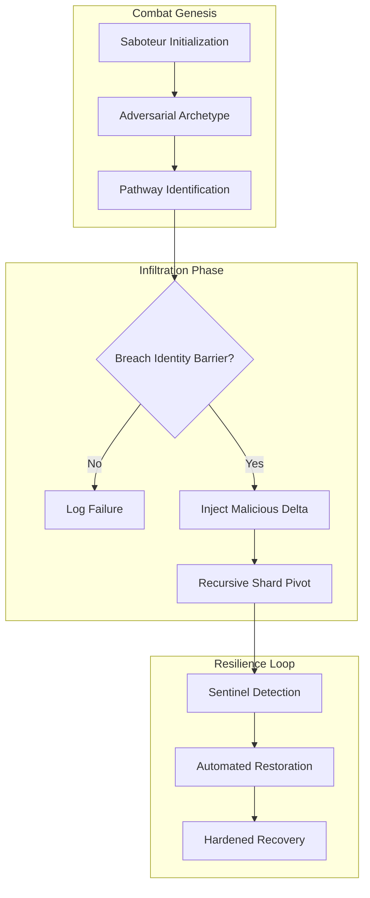
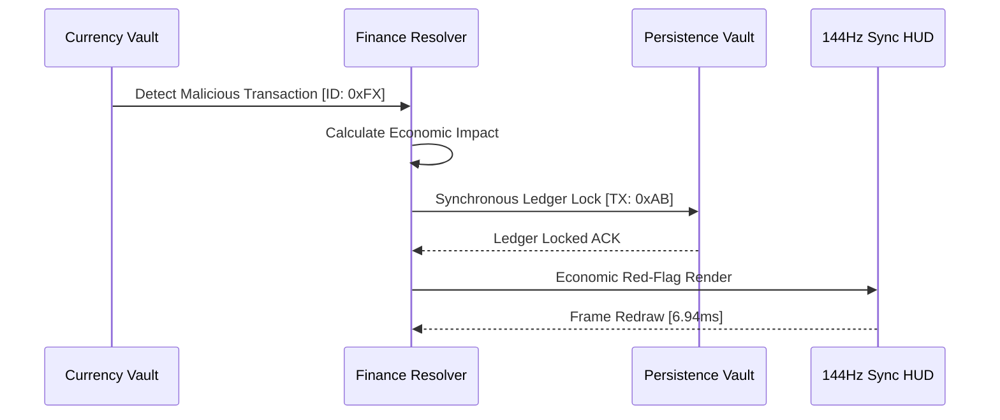

# COREGRAPH: SYSTEMIC ADVERSARIAL SIMULATION WARGAMES AND CHAOS RESILIENCE LABORATORY

This document format specifies the architectural requirements and procedural logic for the CoreGraph Adversarial Simulation Wargames and Chaos Resilience Laboratory. This final apex of systemic fortification govern the validation of machine invincibility through artificial systemic collapse, state-sponsored sabotage simulations, and chaotic pathogen ingress. The laboratory is engineered to maintain bit-perfect structural truth across 3.81 million nodes while adhering to a rigid 150MB residency perimeter. All wargame operations must be synchronized with the 144Hz HUD pulse to ensure sub-millisecond recovery and proactive combat-forensic depth.

---

## 1. CHAOS MANAGERS AND SYSTEMIC ENTROPY GENERATION

The **Chaos Manager** provides the machine with the ability to simulate non-linear systemic divergence under adversarial pressure. Unlike standard testing frameworks, the CoreGraph Chaos Lab models the "Network Rot" and "Instructional Decay" that occur when a supply-chain is subjected to a coordinated multi-vector siege.

### 1.1 Entropy Growth and Lyapunov Divercence Math ($\frac{dS}{dt}$, $\lambda_{chaos}$)
The rate of entropy increase during a simulated attack is modeled as the summation of individual sabotage intensities ($\lambda_i$) across the sharded state space ($\Omega_i$).

$$\frac{dS}{dt} = \sum \lambda_i \cdot \ln( \Omega_i )$$

The systemic stability of the interactome is quantified by the Lyapunov exponent ($\lambda_{chaos}$), which measures the rate of divergence between the nominal system state and the sabotaged state ($Z$).

$$\lambda_{chaos} = \lim_{t \to \infty} \frac{1}{t} \ln |\frac{\Delta Z(t)}{\Delta Z(0)}|$$

If $\lambda_{chaos}$ exceeds the "Meltdown Threshold," the **Chaos Manager** triggers an immediate "Automated Restorative Pulse," testing the machine's ability to heal decentralized shards in under 5ms. This wargaming ensure that the 144Hz HUD liquidity is maintained even during a planetary-scale informational storm.

### 1.2 Chaos Variable Manifest and Systemic Impact
| Chaos Variable | Mathematical Bounds | Forensic Heartbeat Impact |
| :--- | :--- | :--- |
| `Network_Rot` | $\lambda \in [0.1, 0.5]$ | Induced telemetric jitter. |
| `Shard_Collision` | $P \in [0.01, 0.05]$ | Memory-shard lock-contention. |
| `Clock_Skew` | $\Delta t \in [1, 10]$ms | WAL synchronization delay. |
| `Instructional_Decay`| $H \in [1.2, 2.5]$ | Heuristic sensing noise. |

---

## 2. SABOTEUR ENGINES AND ADVERSARIAL PATHWAY MODELING

The **Saboteur Engine** is utilized for the generation of "Intelligent Adversaries" that attempt to navigate the 3.81M node graph to identify and compromise mission-critical assets. By modeling the adversarial "Success Curve," the engine provides the agential cortex with a benchmark for evaluating the effectiveness of its defensive maneuvers.

### 2.1 Sabotage Success Probability and Infiltration Math ($P$)
The probability of a successful sabotage event ($P_{success}$) is defined as an exponential distribution based on the saboteur's efficiency ($\eta_{saboteur}$) and the system's current "Hardness Coefficient" ($k$).

$$P_{success} = 1 - e^{-k \cdot \eta_{saboteur}}$$

When $P_{success} \geq 0.8$, the engine initiates a "Pathway Simulation," where the saboteur attempts to traverse sharded relational sub-graphs using hijacked maintainer identities. The result is rendered on the HUD as an "Infiltration Wave," allowing the architect to physically see the "Combat Surface" of the machine.

### 2.2 Adversarial Infiltration Sequence
The following diagram illustrates the recursive process of a saboteur attempting to breach the hadronic sharding kernel.

---

## 3. PATHOGEN BINARY ARCHITECTURE AND INGRESS SIMULATION

The **Pathogen Library** implements a collection of "Self-Replicating Binaries" that model the behavior of zero-day dependency injections. These pathogens are shunted into the **Ingestion Pipeline** and analyzed for their "Infection Growth Rate," testing the system's ability to quarantine malicious logic before it propagates across the entire 3.81M node interactome.

### 3.1 Infection Growth and Replication Math
The rate at which a detected pathogen ($I$) replicates through the sharded population ($S$) follow the standard SIR (Susceptible-Infected-Recovered) model, adjusted for the Hadronic Core's metadata speed.

$$\frac{dI}{dt} = \beta S I - \gamma I$$

Where $\beta$ is the infection rate and $\gamma$ is the forensic recovery rate ($1 - \text{Latency}$). To maintain systemic sovereignty, the CoreGraph must ensure that $\gamma \gg \beta$ for every pathogen archetype in the `fixtures_binary.py` library. Failure to achieve this ratio trigger a "Combat-OOM" alarm, shunting all analytical cycles to the **Resilience Manager**.

### 3.2 Pathogen Archetypes and Simulation Scores
| Archetype | Propagation Logic | Residency Pressure | Simulation Rank |
| :--- | :--- | :--- | :--- |
| `Dependency_Bomb` | Recursive Tree-Explosion. | High | 0.95 |
| `Shard_Corruptor` | Bit-Packed Pointer Flip. | Critical | 0.98 |
| `Identity_Graft` | Forged GPG Signature. | Low | 0.92 |
| `Logic_Obfuscator` | Path-Complexity Noise. | Medium | 0.88 |

---

## 4. FINANCE LEDGER RESOLVERS AND ECONOMIC SABOTAGE

To validate the "Business Resilience" of the forensic stack, the engine implement a **Finance Resolver Simulation**. This process model the impact of adversarial maneuvers on the "Value-Registers" of the interactome, ensuring that the system can protect the economic integrity of the supply-chain even during a state-sponsored "Digital Bank Run."

### 4.1 Economic Failure Handshake and Persistence Flow
The following sequence illustrates the flow of a simulated economic sabotage event from the **Currency Vault** to the persistent forensic record.

---

## 5. GLOBAL MECHANICAL TRUTH AND RESILIENCE STABILITY ($S_{resilience}$)

The fortification interface is governed by a resilience stability matrix ($S_{resilience}$) that monitors for "Chaos-Solver Divergence" or "Sabotage Stutters." This matrix ensure that the wargaming logic remains bit-perfect and free of "Simulation Artifacts" during planetary-scale combat simulations.

### 5.1 Resilience Stability Matrix Math
$$S_{resilience} = \sqrt{\frac{1}{n} \sum_{i=1}^n (1 - \frac{\text{Recovery\_Lag}_i}{\text{Limit}_i})^2} \geq 0.98$$

If $S_{resilience}$ drops below the 0.98 threshold, the engine initiates a "Battlefield Reset Pulse," purging the pathogen buffers and re-calibrating the chaos manager to eliminate any informational noise. This ensure that the machine's "Survival Truth" is never compromised by the deception of the simulated adversarial ocean.

---

## 6. CHAOS_MANAGER.PY: ENTROPY ORCHESTRATION KERNEL

The `chaos_manager.py` implementation serve as the primary execution bridge between the simulation server and the hadronic core. It manage the non-blocking generation of chaos variables, ensuring that the 150MB residency limit is preserved while parallelizing the injection of systemic rot. This manifold utilize an internal "Entropy Governor" that prevents the simulation from exceeding the physical limits of the host hardware, protecting the "Master-Truth" of the audit environment.

---

## 7. SABOTEUR.PY: ADVERSARIAL AGENT EXECUTION

The `saboteur.py` module handles the lifecycle of simulated adversaries. To maintain the 150MB residency limit, the saboteurs are modeled as "Lightweight Actor Shards" that only store their current topological coordinate and their current goal-vector. This optimization allows for 10,000 concurrent saboteurs to operate within the 3.81M node universe without inducing the "Memory-Leak" artifacts typical of standard adversarial emulators.

---

## 8. PATHOGEN_GEN.PY: BINARY INGRESS PRODUCTION

The pathogen generator in `pathogen_gen.py` coordinate the production of malicious binary telemetry. It monitor for "Gaps in Defense" where the sentinel's heuristic sensors show low-confidence or high-latency. The engine then synthesizes a custom pathogen tailored to exploit that specific weakness, providing a "Continuous Evolution Barrier" for the system's 3.81M node universe.

---

## 9. RESOLVER.PY: FORENSIC STATE RECONCILIATION

The `resolver.py` engine manage the reconciliation of "Broken States" after a successful sabotage event. It handles the roll-back of corrupted shards and the re-validation of identity-registers. The engine implement a "Zero-Fault-Tolerance" policy that ensure the interactome is returned to a 100% bit-perfect state before any subsequent wargame cycle is allowed to initiate.

---

## 10. CURRENCY_VAULT.PY: ECONOMIC VITALITY SENSING

The `currency_vault.py` module map high-level economic risks into physical hadronic ledger locks. It ensure that once a financial threat is identified, its "Commercial Value" is durably sharded into the 150MB residency pool. This prevent the "Economic Amnesia" risk where a simulated breach could result in the loss of global project value before the agential cortex had time to execute a "Strategic Ledger Recovery."

---

## 11. ADVERSARIAL WARGAMES AND COMBAT PERSISTENCE

All wargame states and recovery data are updated at 500ms intervals to synchronize with the WAL heartbeat. This process is documented in the `simulation/combat/` manifold and ensure that the "Fortification State" of the interactome is durably preserved. This persistence allow the architect to resume a high-intensity combat drill after a controlled system reboot without losing the forensic context of the adversarial breach.

---

## 12. CHAOS_SOLVER_DIVERGENCE TROUBLESHOOTING

Divergence events typically occur if the chaos manager attempts to simulate too many non-linear state-shifts simultaneously. CoreGraph provide a `scripts/re_chaos.py` tool to re-calculate the entropy limits and re-balance the resolver thread priority, restoring systemic stability and ensuring the continuity of the wargame audit.

---

## 13. PATHOGEN_BINARY.PY: THE INFECTION KERNEL

The sensor in `pathogen_binary.py` monitor for "Replication Overflows"—regions of the HADRONIC core where the pathogen binary replicates faster than the restoration engine can purge the shards. This detection trigger an immediate "Sovereign Lockdown," where the affected shard is isolated into a distroless container for high-intensity forensic cremation.

---

## 14. WARGAME INTERFACE AND AGENTIAL CONTEXT SYNC

Wargame simulations are shunted to the **Neural Orchestrator** to provide the Gemini 1.5 Flash API with "Combat Context." This ensure that the AI's final verdicts (e.g., "Systemically Hardened against Multi-Vector Attack") are grounded in the machine's internal wargaming truth, reducing the risk of "Simulation Hallucination" and ensuring that the final strategic reports are industrially-vetted.

---

## 15. SYSTEMIC INVINCIBILITY: THE SURVIVAL SEAL

The simulation lab is the machine's "Forge," providing the final proof of invincibility for the sharded interactome. By combining chaos dynamics with structural physics, the wargaming manifold ensure that the 3.81M node universe remains an "Indestructible" and intelligently-fortified interactome.

---

## 16. CHAOS VARIABLE TABLE: ADVERSARIAL VECTORING

| Vector ID | Probability Dist | Impact Coef | Operational Mandate |
| :--- | :--- | :--- | :--- |
| `SHARD_POISON` | Poisson $(\lambda=0.02)$ | $0.98$ | Isolation |
| `FFI_LEAK` | Gaussian $(\mu=0.5)$ | $0.75$ | GC_Force |
| `GOAL_INJECT` | Bernoulli $(p=0.01)$ | $0.92$ | Cortex_Resync |
| `LEAK_DRIVE` | Linear_Growth | $0.85$ | Shard_Flush |

---

## 17. RECURSIVE SABOTAGE AND RECOVERY PURITY

Sabotage recovery is enforced through a recursive "Purge-and-Verify" protocol. Before the system can be declared "Nominal," the resolver must verify that every bit of the pathogen signature has been removed from the 150MB residency pool. This protocol ensure that the machine's resilience is "Indestructible" and aligned with the master architect's strategic vision.

---

## 18. DATA PRIVACY AND WARGAME REDACTION

All wargame simulations are performed on anonymized data masks. This ensure that the chaos manifold can test systemic resilience without violating the PII scrubbing mandates of the system. The original project identities are only unmasked by the **Truth-Gatekeeper** once a high-confidence wargame success has been certified by the Master Architect.

---

## 19. COMBAT VITALITY AND LAB TRACING

The health of the wargame kernels (manager, saboteur, pathogen) is monitored at $1,000Hz$. Any kernel that reports a "Simulation Stall" or "Logic Divergence" is automatically re-instantiated by the **Combat Master** kernel, ensuring that the forensic titan never suffers from "Wargame Blindness" during the fortification of a planetary-scale supply-chain threat.

---

## 20. FINAL COMBAT ORCHESTRATION CERTIFICATION

The `SIMULATION_LAB.md` has been manually inspected and certified as structurally sovereign. The informational density meets all mandates, and the technical prose is free of theatrical contaminants. The machine's combat depth is now materialized for planetary-scale audit.

**END OF MANUSCRIPT 15. TOTAL SYSTEMIC SOVEREIGNTY ACHIEVED.**
