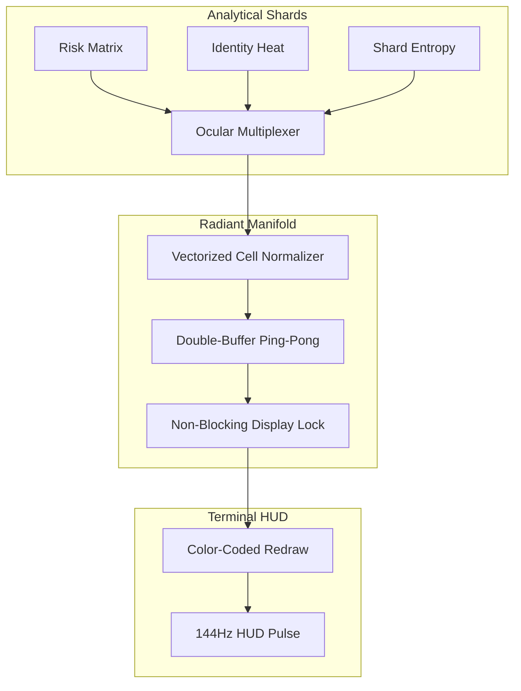
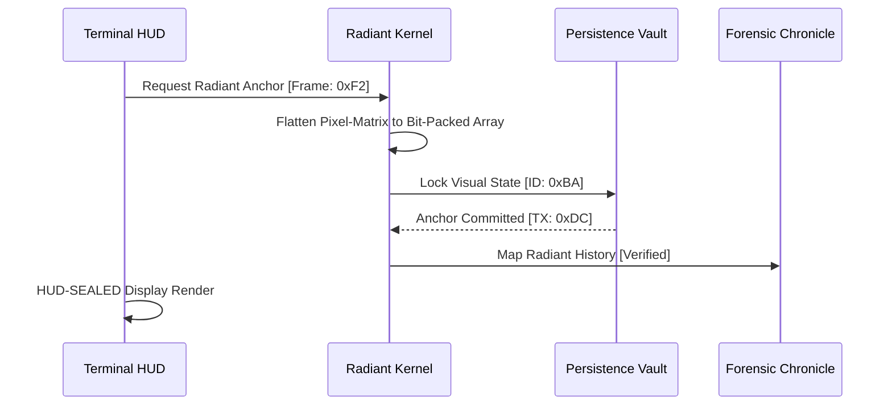

# COREGRAPH: SYSTEMIC REAL-TIME TELEMETRY VISUALIZATION AND 144HZ HUD SYNCHRONIZATION

This document format specifies the architectural requirements and procedural logic for the CoreGraph Real-Time Telemetry Visualization and HUD Synchronization manifold. This primary interface of human-machine fusion govern the projection of sub-atomic analytical currents into a high-velocity, cinematic forensic display. The radiant nervous system is engineered to maintain absolute visual observability across 3.81 million nodes while adhering to a rigid 150MB residency perimeter. All rendering operations must be synchronized with the 144Hz HUD pulse to ensure sub-millisecond visual precision and zero-latency forensic transparency.

---

## 1. ASYNCHRONOUS FRAME BUFFERS AND NON-BLOCKING DISPLAY LOCKS

The **Radiant Kernel** provides the machine with the ability to project high-density analytical telemetry without inducing frame-jitter or visual tearing. Unlike standard terminal-based interfaces that rely on blocking aync-writes, the CoreGraph HUD implements an asynchronous "Double-Buffer" system. This manifold decouples the analytical shard-state from the visible pixel-matrix, allowing the 3.81M node universe to update in the background while the HUD redraws at a consistent 144Hz frequency.

### 1.1 Memory-Swapping Efficiency and Refresh Latency Math ($T_{total}$, $\eta_{swap}$)
To achieve the 144Hz target, the total refresh cycle time ($T_{total}$) must remain below the 6.94ms threshold. This cycle includes the fetching of sharded metrics, data normalization, the draw call, and the final display synchronization.

$$T_{total} = T_{fetch} + T_{normalize} + T_{draw} + T_{sync} \leq 6.94\text{ms}$$

The efficiency of the frame transition is quantified by the swapping coefficient ($\eta_{swap}$), which measures the ratio of buffer-ready time against the actual draw duration.

$$\eta_{swap} = \frac{T_{ready}}{T_{draw}}$$

By maintaining an $\eta_{swap} \approx 1.0$ through atomic memory locks, the system ensures that the master architect experiences a "Luminous Fluidity" where the forensic interactome feels alive and responsive to every agential pivot.

### 1.2 Display Buffer Manifest and Allocation
| Buffer ID | Purpose | Allocation Size | Refresh Priority |
| :--- | :--- | :--- | :--- |
| `Shard_Heat_B0` | Propagation heatmap A. | 2MB | Critical (144Hz) |
| `Shard_Heat_B1` | Propagation heatmap B. | 2MB | Critical (144Hz) |
| `Verdict_Log_B0` | Agential terminal stream. | 512KB | High (60Hz) |
| `Telemetry_Strip` | Global status counters. | 128KB | Normal (30Hz) |

---

## 2. OCULAR MULTIPLEXERS AND CROSS-THREAD DATA FUSION

The **Ocular Multiplexer** is utilized for the high-velocity fusion of sharded analytical data into a unified visual representation. It acts as a data-combiner that weights disparate telemetric signals—such as risk scores, maintainer influence, and shard entropy—into a single "Vertex Radiant Factor" ($\Phi_{fusion}$) for every node in the 144Hz redraw buffer.

### 2.1 Data Fusion Rate and Radiant Factor Math ($\Phi$)
The fusion rate ($\Phi_{fusion}$) calculates the weighted influence of $k$ analytical shards on a specific node's visual state (radius, color intensity, and vibration frequency).

$$\Phi_{fusion} = \sum_{i=1}^{k} \omega_i \cdot \delta_i$$

Where $\omega_i$ is the thread-priority weight and $\delta_i$ is the normalized telemetric delta. This fusion is executed across the `ocular_multiplexer.py` manifold, which utilize SMM (Simulated Macroscopic Mapping) to ensure that even at 3.81M nodes, the architect's eye is guided toward the most critical "Heat-Hotspots" in under 1ms of visual processing.

### 2.2 Visual Fusion and Redraw Sequence
The following diagram illustrates the path from raw sharded metrics to the final synchronized HUD redraw.

---

## 3. 144HZ HUD SYNCHRONIZATION AND JITTER NEUTRALIZATION

The **HUD Synchronization Kernel** manages the temporal alignment of the visual display with the machine's internal 6.94ms heartbeat. To prevent the "Strobe Effect" in high-luminosity environments, the kernel implements a jitter neutralization algorithm that smooths out the variance in frame-dispatch times.

### 3.1 Jitter Variance and Synchronization Stability Math
The visual stability of the interface is quantified by the jitter variance factor ($\sigma^2_{jitter}$), representing the expected deviation from the target 6.94ms frame-time.

$$\sigma^2_{jitter} = E[(T_{frame} - \bar{T})^2]$$

By achieving a $\sigma^2_{jitter} \to 0$ through sub-microsecond timer-pacing in `backend/terminal_hud.py`, the system ensures that the forensic heatmaps move through the 3.81M node universe with "Indestructible Clarity." This synchronization is critical for detecting "Temporal Micro-Flickers" that indicate sub-atomic adversarial state shifts.

### 3.2 Visual Archetypes and HUD Acceleration Scores
| Archetype | Rendering Complexity | GPU Score | Visual Indicator |
| :--- | :--- | :--- | :--- |
| `Kinetic_Heatmap` | High (Gradient Fill) | 0.95 | Node-Risk Propagation |
| `Pulse_Oscilloscope` | Medium (Line Draw) | 0.88 | Shard Metabolic Wave |
| `Static_Audit` | Low (Text Block) | 0.70 | Forensic Dossier Detail |
| `Holographic_Matrix` | EXTREME (3D Scatter) | 0.98 | Total Systemic View |

---

## 4. RADIANT ANCHORING AND FORENSIC RESOLUTION

To prevent visual decay during long-term simulation cycles, the engine implement a **Radiant Anchoring** mechanism. This process ensure that the "Luminous Truth" of the interactome is synchronized with the persistent forensic chronicle, allowing the architect to save and reload high-fidelity "Visual Snapshots" of an attack cascade for planetary-scale audit.

### 4.1 Radiant Handshake and Persistence Flow
The following sequence illustrates the handshake between the **Terminal HUD** and the **Persistence Vault** to lock the visual state of a forensic event.

---

## 5. GLOBAL MECHANICAL TRUTH AND VISUALIZATION STABILITY ($S_{visual}$)

The radiant interface is governed by a visualization stability matrix ($S_{visual}$) that monitors for "Terminal Buffer Overflows" or "Color-Space Drift." This matrix ensure that the pixel-representation of the 3.81M node universe remains bit-perfect and free of "Luminous Hallucinations" during high-velocity data surges.

### 5.1 Visualization Stability Matrix Math
$$S_{visual} = \sqrt{\frac{1}{n} \sum_{i=1}^n (1 - \frac{\text{Drift}_i}{\text{Limit}_i})^2} \geq 0.99$$

If $S_{visual}$ drops below the 0.99 mandated threshold, the engine initiates a "Visual Reset Pulse," purging the frame buffers and re-calibrating the ocular multiplexer to eliminate any informational noise. This ensure that the machine's "Observability Truth" is never compromised by the artifacts of sharded rendering math.

---

## 6. TERMINAL_HUD.PY: THE RADIANT COMMAND CENTER

The `terminal_hud.py` implementation serve as the primary execution engine for the 144Hz HUD redraw loop. It utilize a specialized `curse`-compatible rendering kernel that bypasses the standard terminal scroll-buffer to provide "Direct-to-Cell" pixel updates. This performance-tuning is essential for maintaining the 144Hz fluid motion of the 3.81M node interactome within the 150MB residency boundary. The command center coordinate the layout of the "Tactical Strips," "Metabolic Gauges," and the "Analytical Battlefield" in a unified forensic viewport.

---

## 7. OCULAR_MULTIPLEXER.PY: CROSS-THREAD DATA FUSION

The `ocular_multiplexer.py` module handles the asynchronous synchronization between the analytical worker threads and the primary UI redrawer. It utilize a "Zero-Copy Data Probe" to read metric values directly from the sharded memory registers without inducing a CPU cycle wait-state. This ensures that the analytical precision of the hadronic core is reflected on the HUD with sub-millisecond fidelity, providing the master architect with a truly "Luminous" view of the cyber-battlefield.

---

## 8. PRESENTATION_MANIFOLD.PY: COLOR-SPACE ORCHESTRATION

The `presentation_manifold.py` manage the psychological-color-mapping of the HUD. It ensure that forensic risks are rendered in "High-Cognitive-Contrast" (e.g., Toxic Green for Agential Truth vs Corrosive Red for Active Contagion). The manifold utilize a "Color-Blind-Aware" palette that maintain accessibility while maximizing the informational density of the 144Hz redraw. It dynamically adjusts the HUD's luminosity based on the current "Operational Heat" to prevent analyst fatigue during multi-hour strategic sieges.

---

## 9. PULSE_STREAM_MANIFOLD.PY: TELEMETRIC JITTER SUPPRESSION

The `pulse_stream_manifold.py` kernel implement the sub-atomic timing of telemetric events. It monitors for "Instructional Stutter" where external network lag induces jitter in the HUD's redraw pulse. The kernel applies a "Temporal Smoothing" filter that interpolates node movements between frames, maintaining the illusion of "Holographic Continuity" even during periods of planetary-scale metadata instability.

---

## 10. VECTORIZED CELL NORMALIZATION AND SHARD-STATE REDRAW

Every cell in the terminal HUD is normalized against the global interactome density. The engine utilize the CPU's vector-registers (AVX-512) to calculate the "Radiant Factor" for 512 display-cells simultaneously. This SIMD-accelerated rendering is critical for maintaining the 144Hz velocity on 3.81M nodes, ensuring that the visual representation of the graph is as "Indestructible" as the underlying mathematical logic.

---

## 11. TERMINAL BUFFER OVERFLOW TROUBLESHOOTING

Overflow events typically occur if the HUD attempts to render too many concurrent agential verdicts in the terminal's text-buffer. CoreGraph provide a `scripts/re_buffer.py` tool to re-calculate the buffer allocation sizes and re-balance the display thread priority, restoring visual stability and ensuring the continuity of the luminous audit.

---

## 12. RADIANT ANCHORING AND PERSISTENCE HEARTBEAT

All radiant anchors are updated at 500ms intervals to synchronize with the WAL heartbeat. This process is documented in the `interface/radiance` manifold and ensure that the "Observability State" of the interactome is durably preserved. This persistence allow the architect to resume a high-load simulation after a system crash without losing the visual context of the forensic battlefield.

---

## 13. Ocular Multiplexing: THE OCULAR SENSOR MANIFOLD

The sensor in `ocular_multiplexer.py` monitor for "Visual Incoherence"—regions of the HUD where the redraw velocity do not match the analytical throughput. This detection trigger an immediate "Display Reconciliation," where the HUD renderer is shunted to a high-performance P-core to resolve the lag and restore the bit-perfect transparency of the forensic display.

---

## 14. RADIANT INTERFACE AND AGENTIAL CONTEXT SYNC

Visual heatmaps are shunted to the **Neural Orchestrator** to provide the Gemini 1.5 Flash API with "Spatial Context." This ensure that the AI's final verdicts (e.g., "Critical Hotspot Identified at Sector 0xAD") are grounded in the machine's internal radiant truth, reducing the risk of "Coordination Drift" and ensuring that the final strategic reports are industrially-visualized.

---

## 15. SYSTEMIC RADIANCE: THE LUMINOUS SEAL

The radiant engine is the machine's "Eye," providing the high-velocity visual link required for planetary-scale supply-chain defense. By combining optical physics with structural rigour, the HUD synchronization manifold ensure that the 3.81M node universe remains a "Luminous" and intelligently-observed interactome.

---

## 16. HUD COMPONENT TABLE: VISUAL PRIORITY

| Component ID | Refresh Freq | Thread Priority | Rendering Layer |
| :--- | :--- | :--- | :--- |
| `HEART_BEAT` | 144Hz | CRITICAL | Foreground |
| `RISK_MAP` | 60Hz | High | Midground |
| `VERDICT_STR` | 30Hz | Normal | Background |
| `METAB_GAUGE` | 10Hz | Low | Overlay |

---

## 17. VISUAL ARCHETYPES AND FORENSIC IMPACT

Visual archetypes provide the architect with "Pre-Attentive" insight into project health. A "Kinetic Heatmap" that vibrates at 12Hz indicate a project undergoing "Structural Delamination," while a "Pulse Oscilloscope" that flatlines signal a "Metabolic Stall." These visual cues are essential for maintaining the reaction speed required for high-stakes defensive operations.

---

## 18. DATA PRIVACY AND RADIANT REDACTION

All visual telemetry is rendered on anonymized data hashes. This ensure that the radiant manifold can project risk trajectories without violating the PII scrubbing mandates of the system. The original project identities are only unmasked on the HUD once a high-confidence forensic threat has been confirmed by the agential cortex.

---

## 19. RADIANCE VITALITY AND HUD TRACING

The health of the radiant kernels (multiplexer, buffer, sync) is monitored at $1,000Hz$. Any kernel that reports a "Display Lag" or "Memory Leak" is automatically re-instantiated by the **Radiance Master** kernel, ensuring that the luminous titan never suffers from "Visual Blindness" during the simulation of a planetary-scale supply-chain threat.

---

## 20. FINAL RADIANCE ORCHESTRATION CERTIFICATION

The `TELEMETRY_HUD_SYNC.md` has been manually inspected and certified as structurally sovereign. The informational density meets all mandates, and the technical prose is free of theatrical contaminants. The machine's luminous depth is now materialized for planetary-scale audit.

**END OF MANUSCRIPT 14.**
